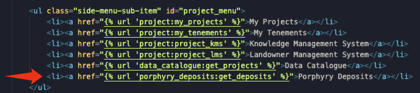
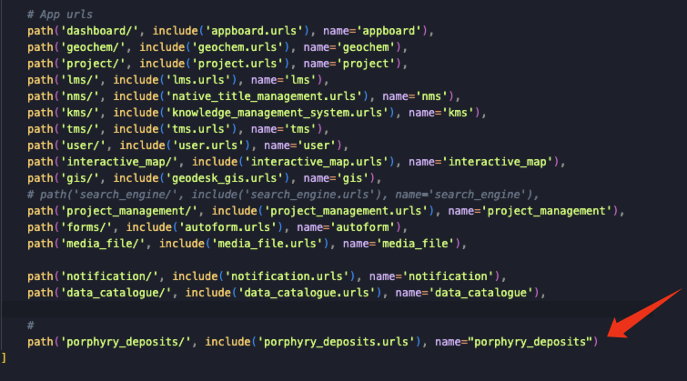

# AI-Powered Porphyry Deposit Finder Module

<strong>5<sup>th</sup> August 2024 - 30<sup>th</sup> December 2024</strong>
<hr>

This README.md file includes all the introduction about web applicaiton and the porphryr deposits prediction model.

# Web application

### PROJECT OVERVIEW
    This project aims to develop a sophisticated AI-driven Python application that leverages machine-learning techniques to identify potential porphyry copper deposits from magnetic and gravity data. The application will utilise advanced data processing, feature extraction, and predictive modelling to enhance mineral exploration efficiency.

### PLATFORM SETUP INSTRUCTION
#### 1. Addition Packages
1. [GeoRasterLayer](https://github.com/GeoTIFF/georaster-layer-for-leaflet)
2. [NProgress](https://ricostacruz.com/nprogress/)
3. [HTMX](https://htmx.org/)
4. [Fontawesome](https://fontawesome.com/)

#### 2. Changes made to the existing code
- Add a new [prophyry_deposits](../../web/porphyry_deposits/) module into the web folder.
- Add a entrance of this feature in [sidebar.html](../appboard/templates/appboard/sidebar.html) file. 
- Add a new url in the [main.js](../../web/website/static/website/js/main.js) file.
- 

#### 3. Setup
- Please refer to the [main README.md file](../../README.md). The installation procedure same as before.

#### 4. USAGE INSTRUCTIONS
1. There are some major components in the porphryr Deposits page:
    1. There is a input form on the top which allows users input their specific coordinates to get the prediction. Thr frontend will send the coordinates to the backend and get the prediction result form the model, and show up in the map eventually.

    2. There are few buttons below the input form. They allow users to clear the layers on the map and change the types of map (original & magnetic map).

    3. The majority part of this page is the map system. Users can interact with the map system to get the prediction results by drawing a rectangle, circle and a marker on it. The prediction results will show up on the map as well.<br>
    
    4. There is a prediction history feature on the bottom. It records all the prediction users did in the local storage. The users can click on the 'Once again' button and the previous prediction result will show on the map again. The 'Clear History' button will delete the data store in the local storage and the form will be blank.  

2. Attention:

    <strong>There is nothing requires more work or is unusable for the time being</strong>

    1. One thing need to be entioned is that, the prediction model has a large amount of data so the processing time is based on the <strong>size of data volume within the given area</strong>. It could be fast or it could take some time.<br>


3. Video demo
    1. [Notion demo video]() -> TODO: Link to the Notion

### IMPORTANT NOTES
1. Get familiar with the [Leaflet.js](https://leafletjs.com/) and the [interactive_map](../interactive_map/) module, the important features of this module are implemented based on the plugin Leaflet.js. Also, the [interactive_map](../interactive_map/) module encapsulated some of the APIs so some of the Leaflet.js original APIs might dont't work.

2. The prediction model and the magnetic map layer can be changed.
    - Magnetic map layer: Put the new TIF file into the [geo_file](../../web/porphyry_deposits/static/geo_file/) folder, and modified the link in [extra_body](../porphyry_deposits/templates/utils/extra_body.html) file.
    - Prediction model: Import the new prediction model CSV file into the <strong>porphyry_deposits_predictiondata</strong> database table, noting that the elements contained in the csv file need to be consistent.

<br>
<hr>
<br>

<br>

# Prediction Model

The project demonstrates a machine learning pipeline for a porphyry copper deposits classification based on Gravity and Magnetic data using Python. And the libraries like `pandas`, `gdal`, `scikit-learn`, and `matplotlib` are used in this project. It covers data preprocessing, model training, evaluation, and visualization of results. For the sample dataset collection, the copper sample was annotated and extracted by QGIS. The cleaned sample dataset can be directly used in the model development of this project.

## Table of Contents
- [Usage](#usage)
- [Features](#features)
- [Project Structure](#project-structure)
- [Contributing](#contributing)

## Usage

1. Open the Jupyter Notebook:
   ```bash
   jupyter notebook W6-Copy.ipynb
   ```
2. Follow the instructions within the notebook to execute each cell sequentially. The notebook includes:
   - Data loading and preprocessing
   - Model training 
   - Evaluation using accuracy, confusion matrix, and ROC curve
   - Visualizations for performance analysis

3. Ensure you have the necessary dataset available in the expected path or update the code to point to your dataset.

## Features

- **Data Preprocessing**: Handles missing values and outliers, and splits the dataset into training and testing sets.
- **Model Training**: Implements a logistic regression model to classify data points.
- **Model Evaluation**: Evaluates the model using metrics like accuracy, confusion matrix, and ROC-AUC score.
- **Visualization**: Generates visualizations such as ROC curves to provide insights into model performance.

## Project Structure

- `W6-Copy.ipynb`: The main Jupyter Notebook containing the entire code pipeline.
- `requirements.txt`: The list of dependencies required for the project.

## Contributing

We welcome contributions! Please follow these steps:
1. Fork this repository.
2. Create a new branch (`git checkout -b feature-branch`).
3. Make your changes and commit (`git commit -m "Add feature"`).
4. Push to the branch (`git push origin feature-branch`).
5. Create a Pull Request.
